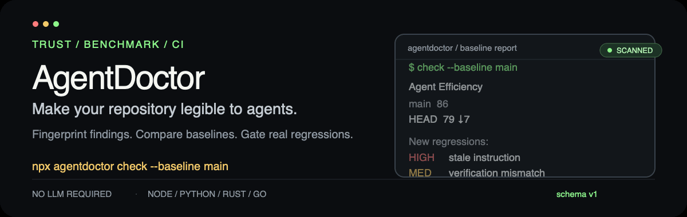

# AgentDoctor

> **A trust-first CI tool for AI coding context.**
> Find the wrong path, missing verification loop, and context regression before your agent does.

<p align="center">
  
</p>

<p align="center">
  <a href="https://www.npmjs.com/package/@gaochenkai/agentdoctor"></a>
  <a href="https://nodejs.org/"></a>
  <a href="./LICENSE"></a>
</p>

AgentDoctor scans the repository instructions and project layout that coding agents rely on. It produces deterministic findings, a calibrated Agent Efficiency Score, stable JSON, and a baseline gate that is safe to put in CI.

It runs without an LLM, API key, dependency installation, or network access during a normal scan.

## Quick start

```bash
npx @gaochenkai/agentdoctor scan
npx @gaochenkai/agentdoctor scan --json
npx @gaochenkai/agentdoctor check --baseline main --min-score 75 --max-regression 0 --fail-on high
```

Node.js 20 or newer is required. `npx @gaochenkai/agentdoctor` opens the interactive dashboard in a terminal and falls back to a scan in non-interactive environments.

## What it understands

- Hierarchical `AGENTS.md`, `CLAUDE.md`, Cursor rules, and Copilot instructions, with dependency, VCS, build, and generated directories excluded.
- Node.js and pnpm workspaces, Python packages, Rust Cargo workspaces, Go modules/workspaces, and mixed repositories.
- Context paths that are actually stale: URLs, globs, templates, routes, commands, package names, and conceptual phrases are ignored. A deleted path is high confidence only when Git history confirms it existed.
- Verification loops for test, lint, typecheck, build, and CI commands.
- Stable finding fingerprints, so moving a line does not create a fake baseline regression.

## Score you can explain

Each finding starts with the existing impact scale:

| Severity | Base impact |
| --- | ---: |
| Critical | 25 |
| High | 12 |
| Medium | 6 |
| Low | 2 |

The effective impact is:

```text
severity impact × clamped confidence × 1 / √rank
```

`rank` is calculated within the same rule group. Each ordinary group is capped at 35 points and oversized-file groups at 25, so a large repository does not lose a point for every similar file. Low-confidence results remain visible under **Needs Review** and do not trigger `fail-on` gates.

When runtime session data is absent, the static dimensions are re-normalized to Context 46.7%, Repository 26.7%, and Verification 26.7%. Verification items marked `not_applicable` do not enter the denominator or create deductions.

## Baseline and regression checks

The baseline is read through `git archive`; the current working tree is never replaced:

```bash
agentdoctor check --baseline main
```

Example output:

```text
Agent Efficiency

main  86
HEAD  79 ↓7

New regressions:

- HIGH: stale instruction
- MEDIUM: +1,800 redundant context tokens
- MEDIUM: verification mismatch
```

The comparison uses fingerprints and detects:

- new or severity-upgraded stale/unresolved context findings;
- verification changes from healthy to warning/broken and command mismatches;
- context bloat from total tokens, de-duplicated wasteful tokens, or lower signal density.

Exit codes are stable: `0` passed, `1` gate failed, and `2` configuration error such as a missing baseline ref. `check --json` returns a fixed top-level shape:

```json
{
  "schemaVersion": 1,
  "result": { "overallScore": 86, "metadata": { "scanDurationMs": 42 } },
  "baseline": null,
  "comparison": null,
  "passed": true,
  "failures": [],
  "exitCode": 0
}
```

`scan --json` always includes `schemaVersion`, `metadata.scanDurationMs`, sorted findings, sorted evidence, and fingerprints. The schema is deterministic; timestamps and timings are the only run-dependent values.

## GitHub Action

Add the action after a full-history checkout so the baseline ref and deleted-path history are available:

```yaml
name: AgentDoctor

on:
  pull_request:

permissions:
  contents: read
  pull-requests: write

jobs:
  agentdoctor:
    runs-on: ubuntu-latest
    steps:
      - uses: actions/checkout@v4
        with:
          fetch-depth: 0

      - uses: agentdoctor/action@v1
        with:
          min-score: 75
          max-regression: 0
          fail-on: high
          baseline: main
          github-token: ${{ secrets.GITHUB_TOKEN }}
```

The action always checks `min-score`. With a baseline, `fail-on` applies only to new or upgraded high-confidence regressions; without one, it applies to current high-confidence findings. `max-regression` is used only when a baseline exists.

It writes a concise report to the Job Summary and updates one sticky PR comment using the `<!-- agentdoctor-report -->` marker. If comment permission is unavailable, the summary remains available and comment publication does not turn a scan failure into a different failure.

Action outputs include `score`, `baseline-score`, `regression`, `regression-count`, `passed`, and `report`.

## Real-repository benchmark

The pinned corpus contains 16 public repositories across Node.js, Python, Rust, Go, monorepos, and mixed projects. It runs three scans per checkout without installing target dependencies, running target tests, or enabling an LLM. Clone and checkout time is excluded.

The latest checked-in benchmark summary is in [`benchmarks/BENCHMARK.md`](./benchmarks/BENCHMARK.md), with the manifest and fingerprint-level labels in [`benchmarks/manifest.json`](./benchmarks/manifest.json) and [`benchmarks/golden.json`](./benchmarks/golden.json).

Selected fixed-commit cases:

| Repository | Type | Result |
| --- | --- | --- |
| [`expressjs/express`](https://github.com/expressjs/express) | Node.js | 100 score, 0 findings |
| [`pallets/flask`](https://github.com/pallets/flask) | Python | 99 score, 1 reviewed finding |
| [`tokio-rs/tokio`](https://github.com/tokio-rs/tokio) | Rust workspace | 93 score, 12 reviewed findings |
| [`spf13/cobra`](https://github.com/spf13/cobra) | Go | 97 score, 3 reviewed findings |
| [`jupyterlab/jupyterlab`](https://github.com/jupyterlab/jupyterlab) | Mixed monorepo | 92 score, 26 findings, 1 low-confidence path needs review |

Run it manually or from the scheduled workflow:

```bash
npm run benchmark                 # network fetches pinned commits when needed
npm run benchmark -- --strict     # release-quality gate
npm run benchmark -- --offline    # only use an existing local cache
```

The benchmark command is intentionally separate from `npm test` so ordinary pull requests are not coupled to upstream repository availability.

## Commands

```text
agentdoctor scan [--json] [--cwd <path>] [--session <path>]
agentdoctor check [--baseline <ref>] [--min-score <0-100>]
                   [--max-regression <0-100>] [--fail-on <severity>]
                   [--json]
agentdoctor fix [--safe]
agentdoctor init
agentdoctor prompt [finding-id] [--all]
```

`fix` and `prompt` remain review-first workflows. This release does not add a Web UI, SaaS account, marketplace, or new agent.

## Development

```bash
npm install
npm test
npm run typecheck
npm run build
npm pack --dry-run
```

The default scanner is static and offline. Runtime session traces are optional and excluded from baseline comparison so local, uncommitted session files cannot create CI noise.

## License

MIT
